# Singulairy Mermaid Diagram Pack

This document gives you high-level Mermaid diagrams for the main product ideas in Singulairy.

The diagrams are intentionally layered:

- Level 0: enterprise and collection view
- Level 1: capability operating model
- Level 2: workflow design view
- Level 3: work item progress view
- Level 4: developer cockpit and AI behavior
- Level 5: evidence, publishing, and ALM rollup

You can copy these into docs, demos, architecture decks, and Confluence with minimal cleanup.

## 1. Capability Landscape

This shows how collections, delivery capabilities, and shared capabilities fit together at the enterprise level.

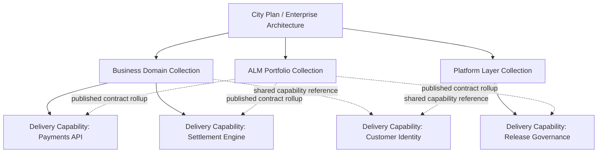

## 2. Capability Operating Model

This is the core capability-centered picture: one capability acting as the operating unit for delivery.

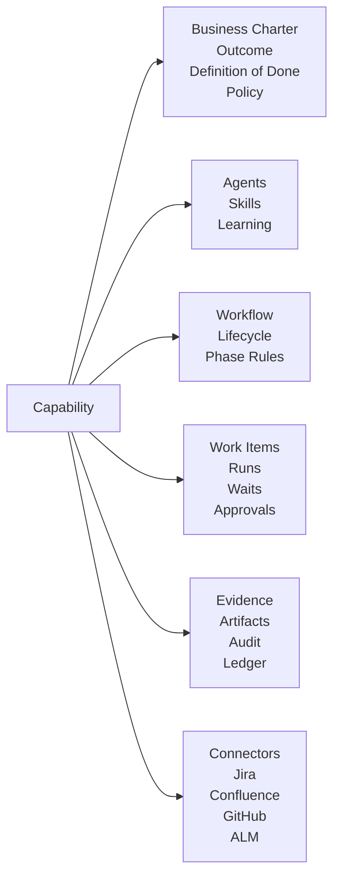

## 3. Collection vs Delivery Capability

This shows the difference between a collection capability and a delivery capability.

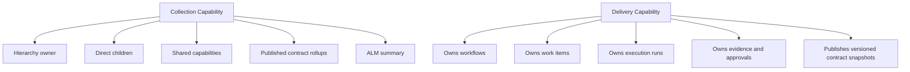

## 4. Workflow Designer Sample

This sample uses a delivery workflow with a typical engineering lane and one approval gate.

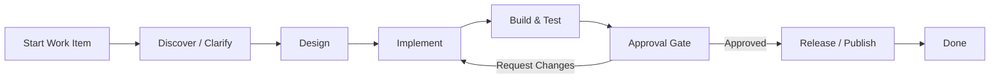

## 5. Workflow Designer View With Contracts

This view shows how the designer connects agents, tools, and artifact contracts.

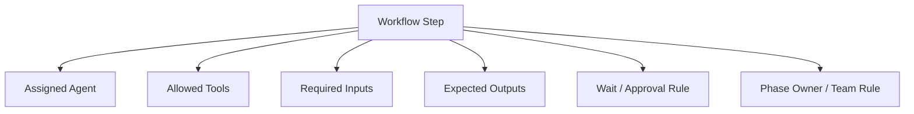

## 6. Work Item Progress

This shows the work item lifecycle from intake to completion, including blocked and waiting states.

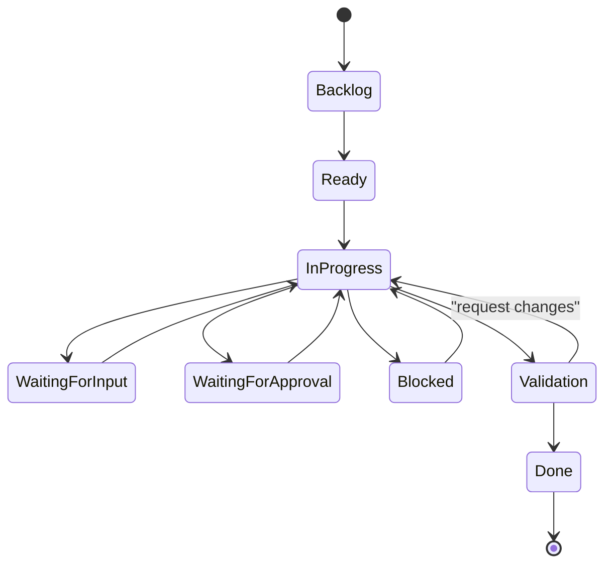

## 7. Work Item Collaboration With Shared Branch

This view matches the newer multiuser model: the work item is the shared
object, not a single local workspace. For repo-backed work, the shared
branch name is the exact `workItem.id`.

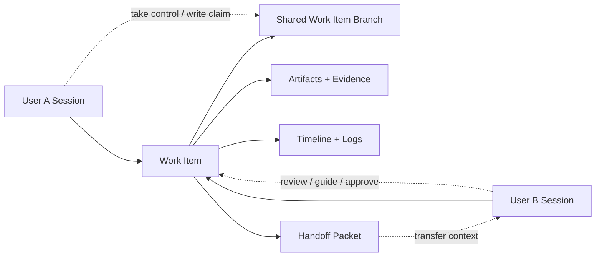

## 7a. User-Scoped Desktop Workspace Resolution

This shows how local execution paths are resolved now: per operator, per
desktop, with repository mappings taking precedence over the capability
fallback.

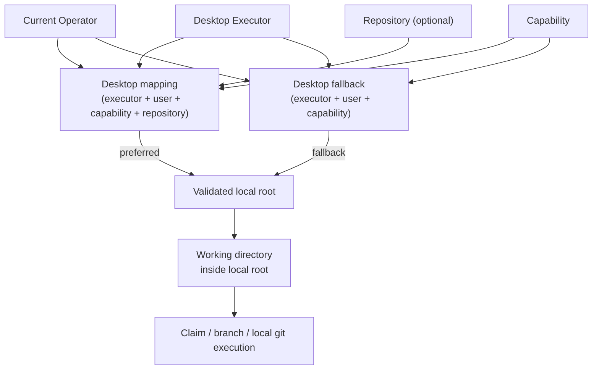

## 8. Developer Cockpit / Workbench

This is the main operating surface idea for `Work`.

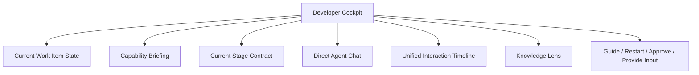

## 9. Chat + Tools + Logs + Learning

This shows the intelligent chat loop you asked for: chat should understand work items, inspect logs, and interpret what happened.

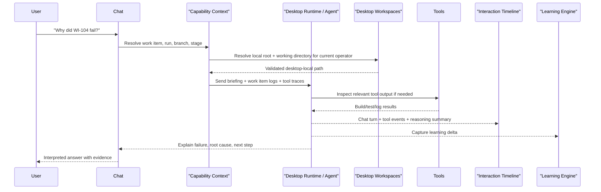

## 10. Evidence And Approval Loop

This shows how output becomes reviewable proof.

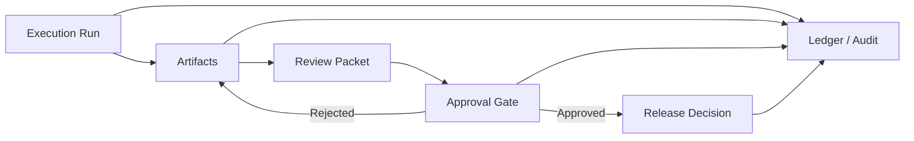

## 11. Published Contracts And ALM Rollup

This shows the enterprise architecture / ALM view where upper layers consume published child contracts instead of live drafts.

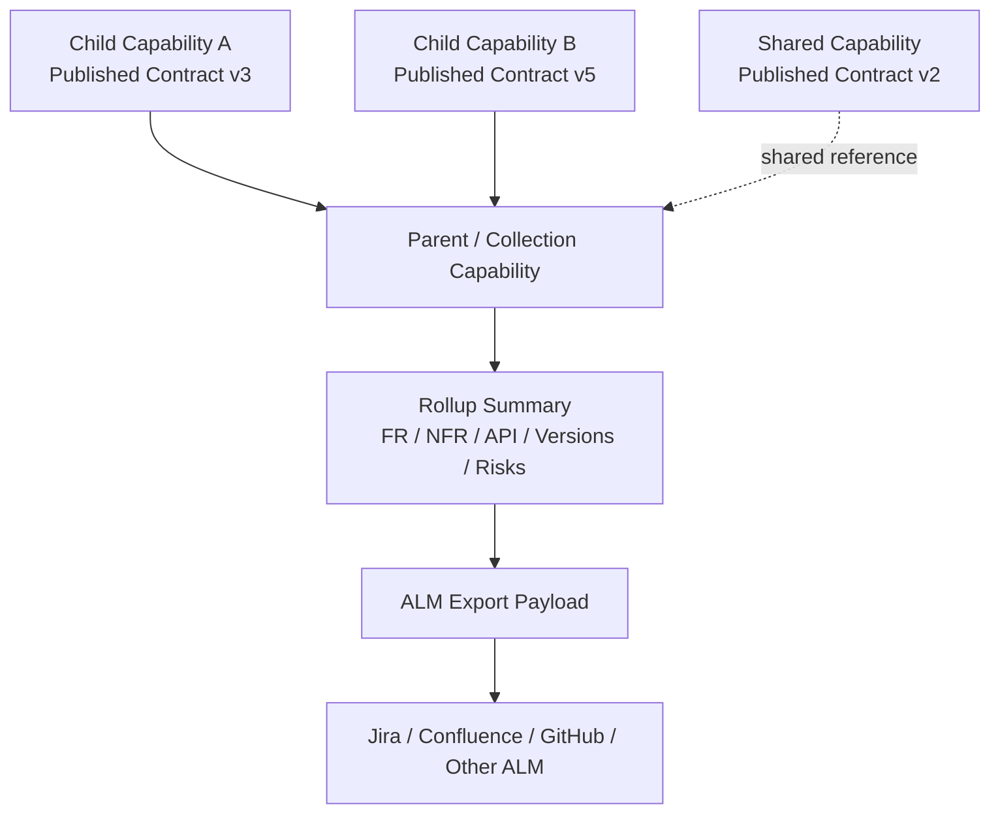

## 12. One Page Story

If you want one single diagram for an executive or demo overview, use this.

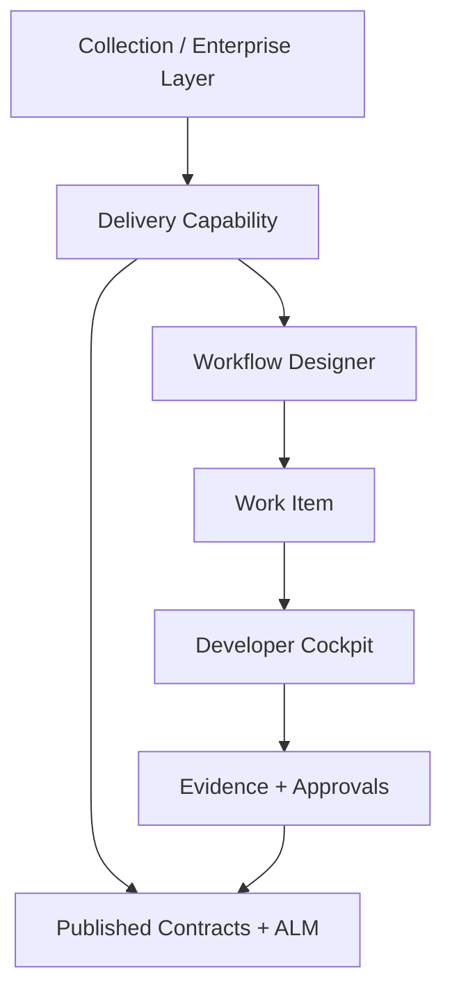

## Suggested Use

- Use diagrams `1-3` for enterprise architecture and onboarding conversations.
- Use diagrams `4-6` for workflow and delivery operating model walkthroughs.
- Use diagrams `7-10` for product demos and developer experience storytelling.
- Use diagrams `11-12` for ALM, governance, and executive-level presentations.
